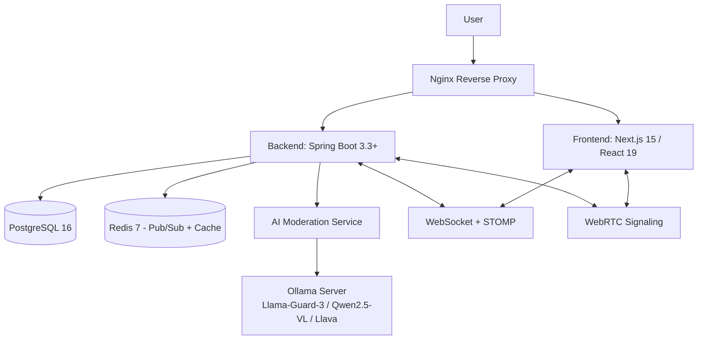

# Realtime Social Network with AI Content Moderation

**Mạng xã hội thời gian thực tích hợp AI kiểm duyệt nội dung vi phạm**  
Một nền tảng mạng xã hội hiện đại hỗ trợ đăng bài, bình luận, chat nhóm, gọi video/audio thời gian thực, với hệ thống AI tự động phát hiện và xử lý nội dung vi phạm (text + hình ảnh) dựa trên các mô hình ngôn ngữ lớn chạy local.

## Mục tiêu & Tính năng chính

- **Realtime Social Features**
  - Đăng bài, bình luận, like/reaction
  - Chat cá nhân/nhóm thời gian thực
  - Gọi video/audio (peer-to-peer qua WebRTC)

- **AI Moderation**
  - Tự động phân loại & chặn nội dung vi phạm quy tắc cộng đồng
  - Hỗ trợ cả text (Llama-Guard) và hình ảnh (Qwen2.5-VL, Llava)
  - Chạy local với Ollama → bảo mật cao, không phụ thuộc API bên thứ ba

- **Kiến trúc**
  - Hệ thống modular monolith: Một ứng dụng duy nhất, chia thành nhiều module logic (auth, user, post, chat, v.v.), mỗi module tách biệt về code, nhưng vẫn chạy chung một process, một database, dễ mở rộng
  - CI/CD tự động qua GitHub Actions
  - Triển khai trên cloud (AWS EC2) hoặc local (Docker)

## Kiến trúc tổng thể



## Tech Stack


## Cấu trúc thư mục

```
.
├── backend/ # Spring Boot multi-module
├── frontend/ # Next.js 15 project (App Router + TypeScript)
├── ai/ # AI scripts, notebooks, fine-tuning, datasets
├── docker/ # Dockerfiles & service configs
│ ├── backend/ # Dockerfile cho backend
│ ├── frontend/ # Dockerfile cho frontend
│ ├── moderation/ # Dockerfile cho AI moderation service
│ ├── ollama/ # Dockerfile cho Ollama server (nếu custom)
│ └── configs/ # Cấu hình cho các service
│ ├── nginx/
│ ├── postgres/
│ ├── redis/
│ └── ollama/
├── .github/
│ └── workflows/ # CI/CD pipelines (GitHub Actions)
├── test-reports/ # Auto-generated test reports (JUnit, Jest, ...)
├── docker-compose.yml # File compose toàn bộ hệ thống
└── README.md
```

## Người thực hiện

- **Họ tên**: Đỗ Quang Huy
- **MSSV**: B2205870
- **Email**: huyb2205870@student.ctu.edu.vn
- **Trường**: Đại học Cần Thơ (CTU)
